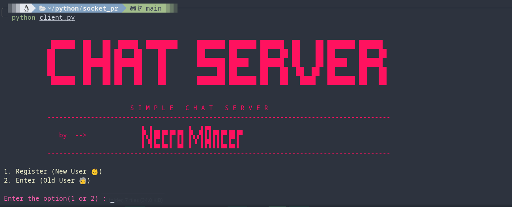

# SIMPLE CHAT SERVER

---
-  It is a simple chat server, using Sockets 
-  Pretty good and clean , can be connect through internet  or locally 
-  Server is designed to handle good amount of clients with good Security(still improving)
-  Tried to for better good simple chat with friends or any :::))) other ...
-  It is a fun , side project ,  Making a chat server requires a lot of  aspect so that it work and scale better, so it is very time consuming also 
-  Will do my best and add more feature which may be better to use 

---

## what to do :
- YEAH I KNOW, There is lot of bugs (I am removing it...) 
- Optimizing the flow, removing each and every bug .
- Creating Test of it , on various level (so that it could be a simple good chat server)
- Adding Room feature in it(Added but still flow is not upto the mark)
- Adding Logging (for debug and crash report)
